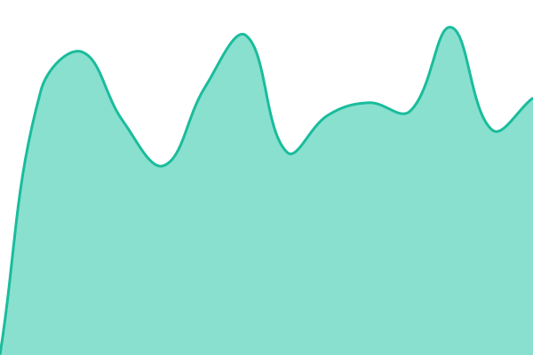
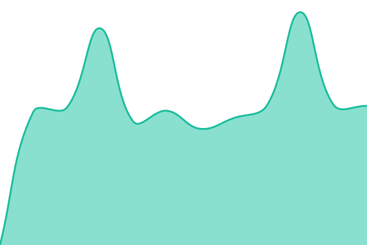
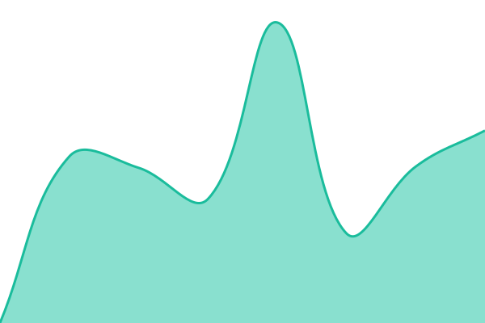

# [📈 Live Status](https://status.degoholding.vn): <!--live status--> **🟧 Partial outage**

This repository contains the open-source uptime monitor and status page for [degoholding](https://status.degoholding.vn), powered by [Upptime](https://github.com/upptime/upptime).

With [Upptime](https://upptime.js.org), you can get your own unlimited and free uptime monitor and status page, powered entirely by a GitHub repository. We use [Issues](https://github.com/degoholding/status/issues) as incident reports, [Actions](https://github.com/degoholding/status/actions) as uptime monitors, and [Pages](https://status.degoholding.vn) for the status page.

<!--start: status pages-->
<!-- This summary is generated by Upptime (https://github.com/upptime/upptime) -->
<!-- Do not edit this manually, your changes will be overwritten -->
<!-- prettier-ignore -->
| URL | Status | History | Thời gian phản hồi | Thời gian hoạt động (Uptime) |
| --- | ------ | ------- | ------------- | ------ |
|  [Dego Holding App](https://app.degoholding.vn/) | Hoạt động bình thường | [dego-holding-app.yml](https://github.com/degoholding/status/commits/HEAD/history/dego-holding-app.yml) | 

 400ms
     
 | 

<a href="https://status.degoholding.vn/history/dego-holding-app">100.00%</a>
    

|  [Dego Holding Homepage](https://degoholding.com) | Sập mạng | [dego-holding-homepage.yml](https://github.com/degoholding/status/commits/HEAD/history/dego-holding-homepage.yml) | 

 2664ms
     
 | 

<a href="https://status.degoholding.vn/history/dego-holding-homepage">87.27%</a>
    

|  [Mesa Message Gateway (API)](https://api-mesa.degoholding.vn) | Hoạt động bình thường | [mesa-message-gateway-api.yml](https://github.com/degoholding/status/commits/HEAD/history/mesa-message-gateway-api.yml) | 

 966ms
     
 | 

<a href="https://status.degoholding.vn/history/mesa-message-gateway-api">100.00%</a>
    

|  [Mesa Dashboard (Quản trị)](https://mesa.degoholding.vn) | Hoạt động bình thường | [mesa-dashboard-quan-tri.yml](https://github.com/degoholding/status/commits/HEAD/history/mesa-dashboard-quan-tri.yml) | 

 422ms
     
 | 

<a href="https://status.degoholding.vn/history/mesa-dashboard-quan-tri">100.00%</a>
    

|  [My Firebase API (Core Backend)](https://api.degoholding.vn) | Hoạt động bình thường | [my-firebase-api-core-backend.yml](https://github.com/degoholding/status/commits/HEAD/history/my-firebase-api-core-backend.yml) | 

 1318ms
     
 | 

<a href="https://status.degoholding.vn/history/my-firebase-api-core-backend">100.00%</a>
    

|  [ABA Chemical](https://abachemical.com) | Hoạt động bình thường | [aba-chemical.yml](https://github.com/degoholding/status/commits/HEAD/history/aba-chemical.yml) | 

 4011ms
     
 | 

<a href="https://status.degoholding.vn/history/aba-chemical">95.61%</a>
    

|  [AGC Việt Nam](https://agcvietnam.com.vn) | Hoạt động bình thường | [agc-viet-nam.yml](https://github.com/degoholding/status/commits/HEAD/history/agc-viet-nam.yml) | 

 3028ms
     
 | 

<a href="https://status.degoholding.vn/history/agc-viet-nam">99.61%</a>
    

|  [IDA Global](https://idaglobal.com.vn) | Hoạt động bình thường | [ida-global.yml](https://github.com/degoholding/status/commits/HEAD/history/ida-global.yml) | 

 2203ms
     
 | 

<a href="https://status.degoholding.vn/history/ida-global">100.00%</a>
    

|  [iCare Pharma](https://icarepharma.com.vn) | Hoạt động bình thường | [i-care-pharma.yml](https://github.com/degoholding/status/commits/HEAD/history/i-care-pharma.yml) | 

 4122ms
     
 | 

<a href="https://status.degoholding.vn/history/i-care-pharma">99.51%</a>
    

|  [Dr. Xanh](https://drxanh.com) | Hoạt động bình thường | [dr-xanh.yml](https://github.com/degoholding/status/commits/HEAD/history/dr-xanh.yml) | 

 1757ms
     
 | 

<a href="https://status.degoholding.vn/history/dr-xanh">100.00%</a>
    

|  [N2 Agro](https://n2agro.vn) | Hoạt động bình thường | [n2-agro.yml](https://github.com/degoholding/status/commits/HEAD/history/n2-agro.yml) | 

 2102ms
     
 | 

<a href="https://status.degoholding.vn/history/n2-agro">100.00%</a>
    

<!--end: status pages-->

[**Visit our status website →**](https://status.degoholding.vn)

## 📄 License

- Powered by: [Upptime](https://github.com/upptime/upptime)
- Code: [MIT](./LICENSE) © [Anand Chowdhary](https://anandchowdhary.com), supported by [Pabio](https://pabio.com)
- Data in the `./history` directory: [Open Database License](https://opendatacommons.org/licenses/odbl/1-0/)
